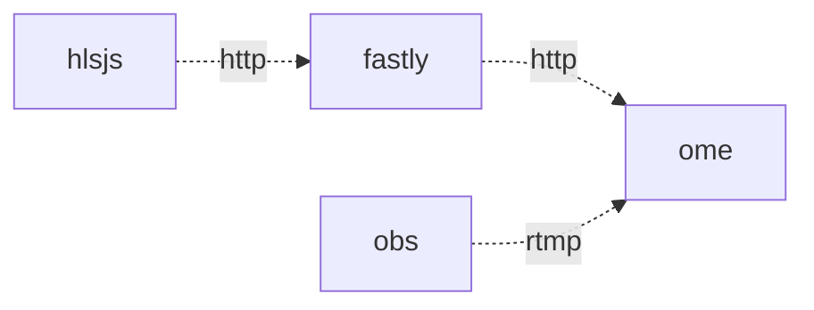

# rtmp2llhls

A demonstration of using OBS Studio, OvenMediaEngine, Fastly and hls.js to deliver a low-latency HLS stream.

## Howto
- clone this repo and `cd` into the directory
- `terraform init`
- `cp terraform.tfvars.example terraform.tfvars`
- edit `terraform.tfvars` to populate your fastly api key and gcp project values
- `terraform apply`
- configure OBS (see below)
- start streaming
- click the player url
- click apply

you should be able to arrange OBS and your browser side by side on your screen and observe the latency to be 3 - 5 seconds

## OBS Config

- Sources
  - Add (+)
    - Browser
      - OK
        - URL: https://time.gov
        - Width: 1920
        - Height: 1024

- Settings
  - Stream
    - Service: Custom
    - Server: $paste_terraform_output
    - Stream Key: stream
  - Output
    - Streaming 
      - Video Bitrate: 5000 Kbps
  - Video
    - Base (Canvas) Resolution: 1920x1080
    - Output (Scaled) Resolution: 1920x1080
    - Common FPS Values: 30
